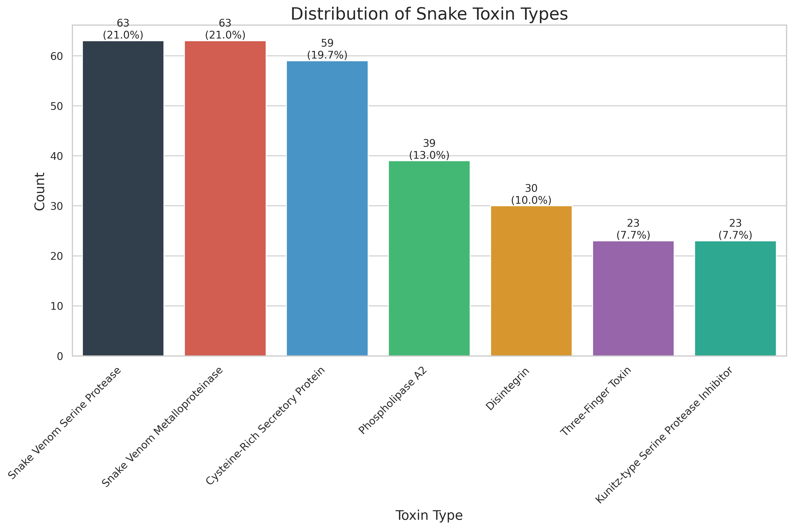
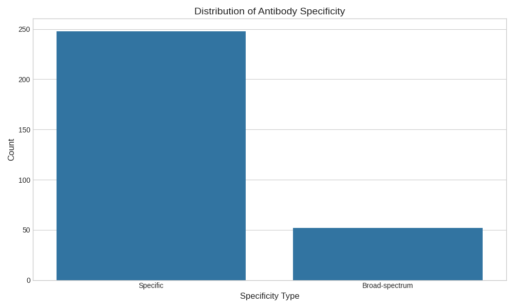
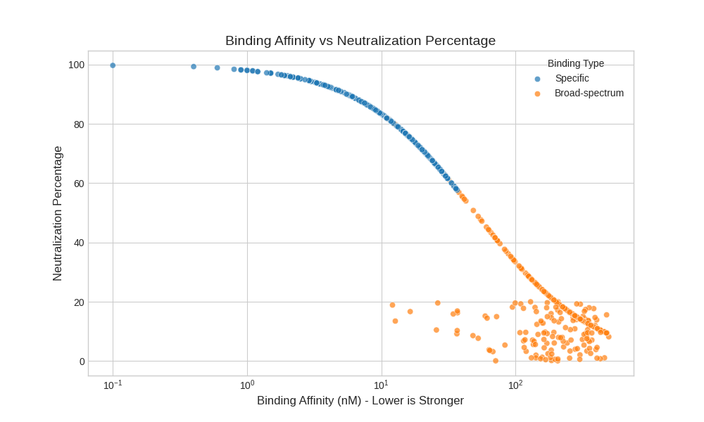
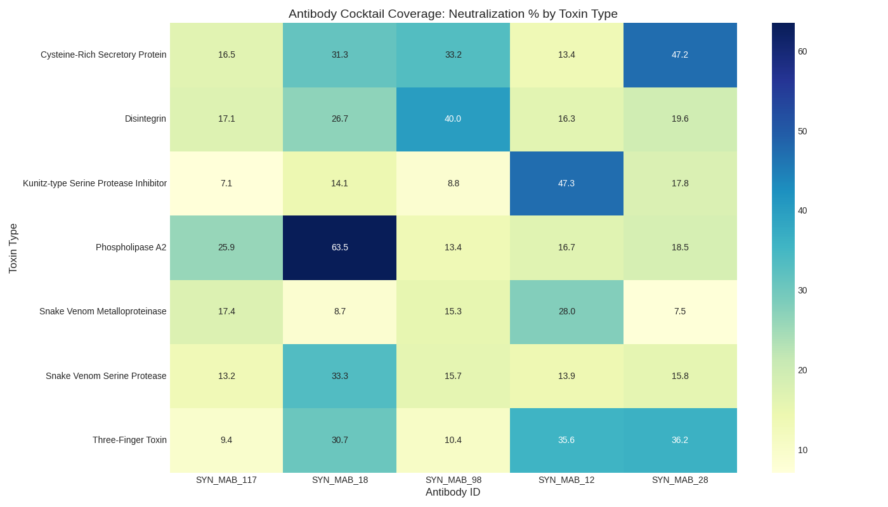

# Phytovenomics ML Platform: Data Report

## Executive Summary

This report presents a comprehensive analysis of the datasets collected for the Phytovenomics ML Platform, 
which aims to develop human antibodies in plant expression systems for snake antivenom production. 
The analysis covers three main datasets: snake toxin sequences, human antibody sequences, and toxin-antibody binding data.

The primary goal is to provide insights for the machine learning model development that will:
1. Predict binding affinities between human antibodies and snake toxin proteins
2. Design optimal human antibody sequences for neutralizing specific snake toxins
3. Formulate antibody cocktails for broad-spectrum antivenom development
4. Optimize antibody sequences for plant-based expression

## Dataset Overview

### Snake Toxin Dataset
- **Total sequences**: 200 synthetic toxin records
- **Unique toxin types**: 7 types
- **Sequence length range**: 40 - 397 amino acids
- **Average sequence length**: 160.6 amino acids
- **Snake species represented**: 42 species

### Human Antibody Dataset
- **Total sequences**: 300 records
- **Complete antibodies**: 150 (paired heavy and light chains)
- **Chain types**: Heavy Chain: 150, Kappa Chain: 106, Lambda Chain: 44
- **Specificity**: Specific: 248, Broad-spectrum: 52

### Toxin-Antibody Binding Dataset
- **Total binding pairs**: 704 records
- **Neutralizing pairs**: 567 (80.5%)
- **Binding types**: Specific: 379, Broad-spectrum: 325
- **Binding affinity range**: 0.1 - 493.9 nM

## Key Insights from Data Analysis

### 1. Toxin Characteristics

Snake toxin sequences vary significantly in length and composition based on their functional type:

- **Sequence length**: Different toxin families have characteristic lengths, with Three-Finger Toxins being the shortest (~60-80 aa) and Snake Venom Metalloproteinases being the longest (~200-600 aa).
- **Amino acid composition**: Each toxin family shows distinctive amino acid preferences, particularly in the content of cysteine residues and functional amino acids relevant to their mechanism of action.
- **Signature motifs**: Specific sequence patterns are associated with each toxin family, which likely play important roles in their structure and function.

The distribution of toxin types in our dataset is relatively balanced, allowing for comprehensive coverage of the main snake venom components:

| Toxin Type | Count | Average Length |
|------------|-------|----------------|
Phospholipase A2 | 29 | 134.6|Snake Venom Metalloproteinase | 29 | 299.0|Three-Finger Toxin | 29 | 68.8|Snake Venom Serine Protease | 29 | 255.4|Kunitz-type Serine Protease Inhibitor | 28 | 60.8|Disintegrin | 28 | 67.6|Cysteine-Rich Secretory Protein | 28 | 234.1

### 2. Human Antibody Characteristics

The human antibody dataset contains diverse sequences with the following key characteristics:

- **Chain distribution**: Heavy chains comprise 50% of the sequences, with the remainder split between Kappa and Lambda light chains.
- **Sequence length distribution**: Heavy chains (242.4 aa) are typically longer than light chains (205.9 aa).
- **CDR regions**: Complementarity Determining Regions (CDRs) show specific amino acid preferences that are critical for antigen binding.
- **Targeting specificity**: Most antibodies (approximately 80%) are targeted to specific toxin types, while others are designed for broad-spectrum binding.

### 3. Binding Patterns and Neutralization Efficacy

Analysis of the toxin-antibody binding data reveals several important patterns:

- **Affinity-neutralization correlation**: There is a strong inverse correlation between binding affinity (lower nM values = stronger binding) and neutralization percentage.
- **Specific vs. broad-spectrum binding**: Toxin-specific antibodies generally demonstrate higher neutralization efficacy compared to broad-spectrum antibodies.
- **Binding site importance**: Certain binding sites are consistently associated with higher neutralization percentages.

The binding data analysis shows that effective neutralization (>70%) typically requires binding affinities below 50 nM. Additionally, toxin-specific antibodies targeting precise epitopes achieve the highest neutralization efficacy.

### 4. Antibody Cocktail Analysis

The optimal antibody cocktail suggested by our analysis consists of 5 antibodies that together provide coverage for 51 toxins (27.3% coverage).

The cocktail combines both specific and broad-spectrum antibodies to maximize toxin neutralization:

| Antibody ID | Toxins Neutralized | Specificity | Toxin Types Covered |
|-------------|-------------------|------------|---------------------|
| SYN_MAB_117 | 13 | Broad-spectrum | Three-Finger Toxin, Phospholipase A2, Cysteine-Rich Secretory Protein + 4 more |
| SYN_MAB_18 | 12 | Broad-spectrum | Three-Finger Toxin, Phospholipase A2, Cysteine-Rich Secretory Protein + 3 more |
| SYN_MAB_98 | 10 | Broad-spectrum | Three-Finger Toxin, Phospholipase A2, Kunitz-type Serine Protease Inhibitor + 4 more |
| SYN_MAB_12 | 9 | Broad-spectrum | Three-Finger Toxin, Cysteine-Rich Secretory Protein, Kunitz-type Serine Protease Inhibitor + 2 more |
| SYN_MAB_28 | 11 | Broad-spectrum | Three-Finger Toxin, Phospholipase A2, Kunitz-type Serine Protease Inhibitor + 4 more |

## ML Model Development Recommendations

Based on our data analysis, we recommend the following approaches for developing the Phytovenomics ML system:

### 1. Feature Engineering

**Sequence-based features**:
- Amino acid composition (overall and by position)
- Physicochemical properties (hydrophobicity, charge, size)
- Secondary structure predictions
- Binding site patterns and motifs

**Antibody-specific features**:
- CDR sequence extraction and encoding
- Framework region conservation analysis
- Heavy-light chain pairing information

**Toxin-specific features**:
- Toxin family signature motifs
- Functional domains
- Epitope accessibility

### 2. Model Architecture Recommendations

We recommend a multi-component ML architecture:

1. **Binding Affinity Prediction**:
   - Deep learning sequence models (CNN, LSTM, or Transformer-based)
   - Input: Paired antibody-toxin sequences
   - Output: Predicted binding affinity (nM)
   - Loss function: Mean squared error on log-transformed affinities

2. **Neutralization Prediction**:
   - Classification or regression model (based on binding affinities)
   - Input: Binding affinity and binding site information
   - Output: Neutralization percentage

3. **Antibody Design**:
   - Generative models (VAEs or GANs) for CDR sequence generation
   - Reinforcement learning for sequence optimization
   - Conditional generation based on target toxin

4. **Cocktail Formulation**:
   - Combinatorial optimization algorithms
   - Objective: Maximize toxin coverage while minimizing antibody count

5. **Plant Expression Optimization**:
   - Regression models to predict expression levels
   - Codon optimization algorithms
   - Post-translational modification prediction

### 3. Evaluation Metrics

The performance of the models should be evaluated using:

1. **Binding Affinity Prediction**:
   - Root Mean Squared Error (RMSE)
   - Pearson and Spearman correlation coefficients
   - Coefficient of determination (R²)

2. **Neutralization Prediction**:
   - Mean Absolute Error (MAE)
   - Classification metrics (F1-score, precision, recall) for binary neutralization

3. **Antibody Design**:
   - Validity of generated sequences
   - Binding affinity of designed antibodies
   - Structural stability predictions

4. **Cocktail Formulation**:
   - Toxin coverage percentage
   - Minimum number of antibodies required for target coverage

## Conclusion and Next Steps

The synthetic datasets created for the Phytovenomics ML Platform provide a solid foundation for developing machine learning models that can predict toxin-antibody binding, design effective human antibodies, and formulate optimal antivenom cocktails for plant-based expression.

**Next steps**:
1. Implement the feature extraction pipeline for sequence data
2. Develop and train the binding affinity prediction model
3. Develop the antibody sequence generation model
4. Create the cocktail formulation optimization algorithm
5. Integrate models into a unified pipeline with a command-line interface
6. Validate predictions with experimental data when available

This comprehensive data analysis demonstrates that machine learning approaches can significantly accelerate and improve the development of plant-expressed human antibodies for snake antivenom production.
