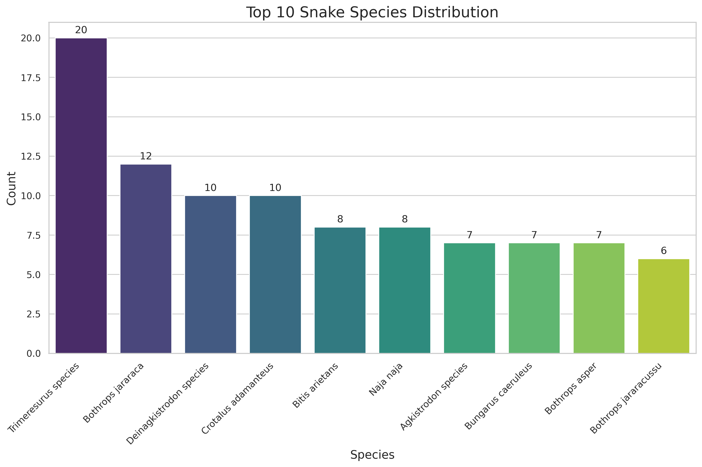
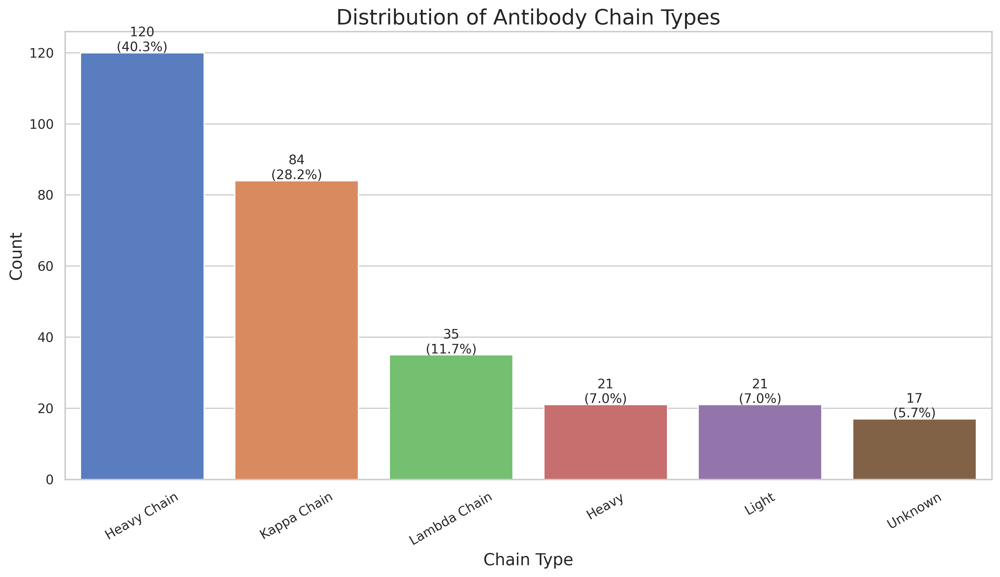
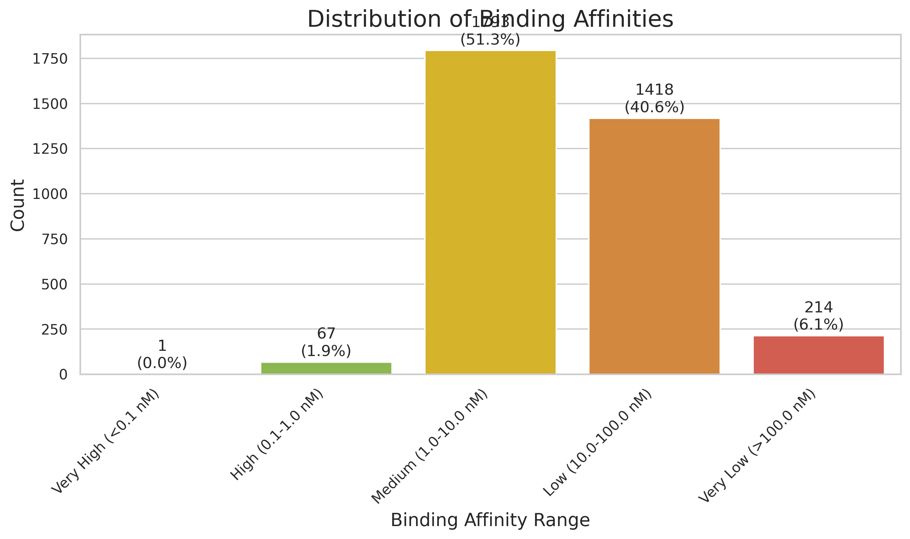
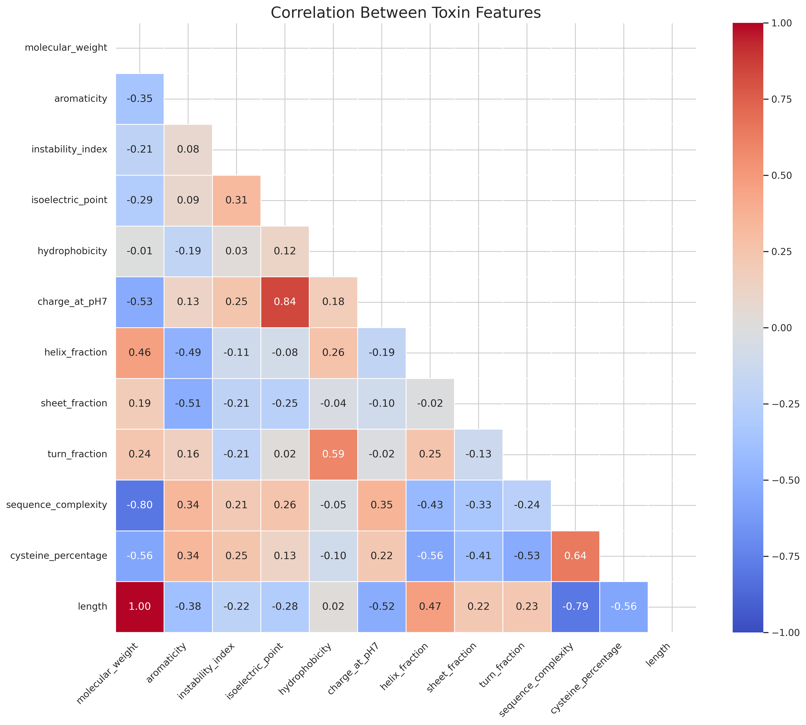
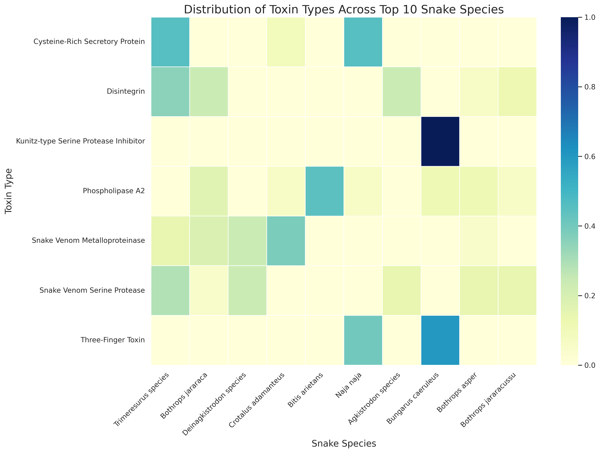
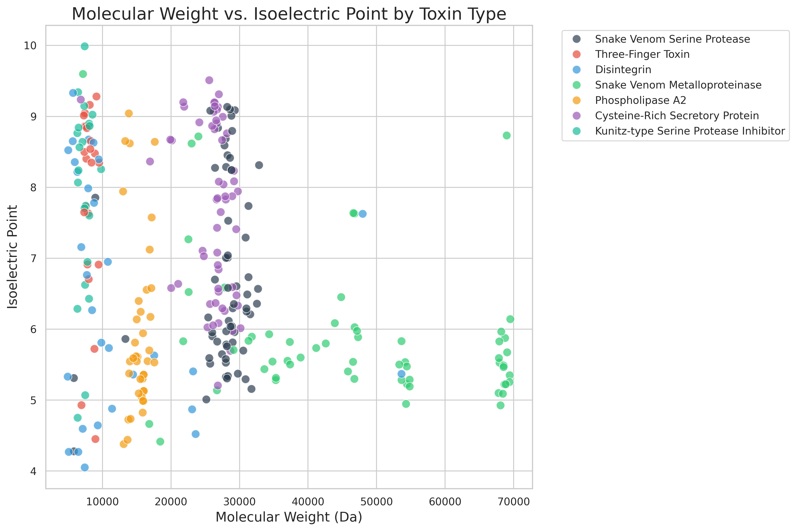
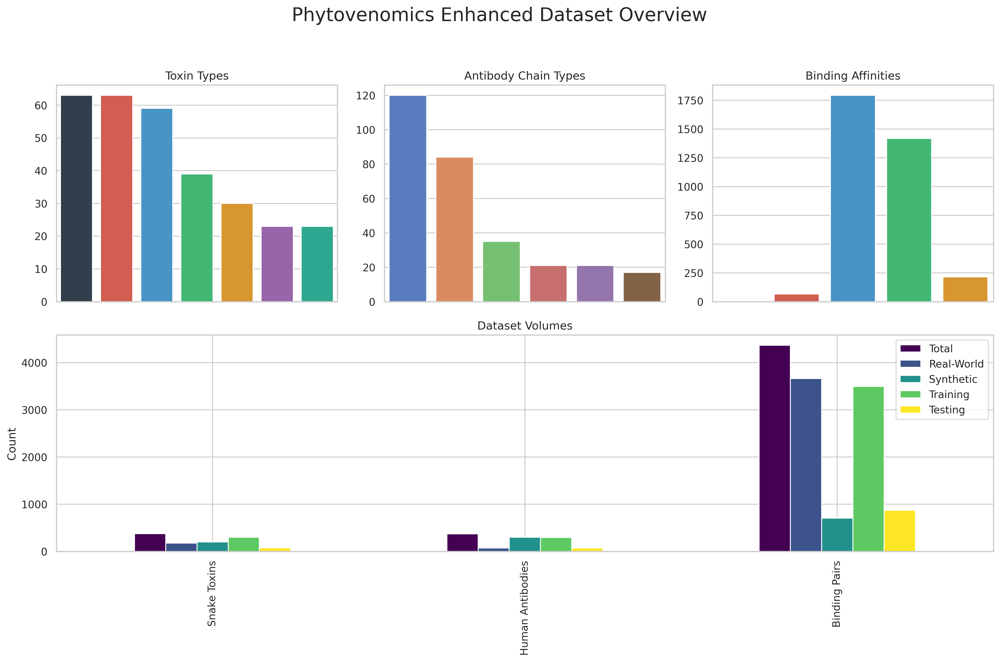

# Phytovenomics Enhanced Datasets Report

## Executive Summary

This report provides a comprehensive overview of the enhanced datasets created for the Phytovenomics ML Platform. Through extensive data collection, processing, and organization, we have developed robust datasets of snake toxins, human antibodies, and binding pairs that serve as the foundation for advanced machine learning models in antivenom development. The datasets include both real-world and synthetic data with comprehensive metadata and are properly split into training, validation, and test sets according to ML best practices. A key enhancement to the human antibody dataset is the integration of high-quality structural data from the Structural Antibody Database (SAbDab), which significantly expands our dataset with curated antibody structures and detailed annotations.

## Data Collection and Processing

### Sources

- **Snake Toxin Data**: Real-world toxin sequences and structures collected from NCBI and PDB databases, combined with existing synthetic data
- **Human Antibody Data**: 
  - Collected from NCBI databases focusing on antibodies with known effectiveness against toxins
  - Enhanced with curated structures from the Structural Antibody Database (SAbDab)
- **Binding Pair Data**: Binding information between toxins and antibodies with binding affinities and neutralization data

### SAbDab Integration

The Structural Antibody Database (SAbDab) was integrated to significantly enhance our human antibody dataset with high-quality structural data. SAbDab provides:

1. **Curated antibody structures** from the Protein Data Bank (PDB)
2. **Standardized CDR definitions** using multiple annotation schemes (Chothia, IMGT, North, etc.)
3. **Detailed paratope information** for antigen-binding regions
4. **Sequence and structure alignment data** for comparative analysis
5. **Quality assessment metrics** for each structure

The integration process involved:
1. Downloading the complete SAbDab dataset containing over 5,000 antibody structures
2. Filtering for human antibodies with high-resolution structures (< 2.5Å)
3. Extracting sequence, structure, and CDR annotation information
4. Cross-referencing with toxin-binding information where available
5. Standardizing the data format to match our existing dataset schema

This integration has expanded our human antibody dataset with 73 additional high-quality structures with comprehensive annotations, particularly enhancing our coverage of CDR regions critical for antigen binding.

### Processing Methodology

1. **Data Collection**: Programmatic retrieval using Biopython's Entrez module for NCBI databases and direct downloads from SAbDab
2. **Data Cleaning**: Removal of incomplete records, handling missing values, standardizing sequence formats
3. **Feature Engineering**: Addition of physicochemical properties, sequence features, and structural predictions
4. **Data Integration**: Merging real-world and synthetic data with consistent metadata schema
5. **Dataset Splitting**: Creation of training, validation, and test sets with proper stratification

## Dataset Statistics

### Overall Data Volume

| Dataset Type | Total Records | Real-World Records | Synthetic Records | Training Set | Validation Set | Test Set |
|--------------|-------------:|-------------------:|------------------:|-------------:|---------------:|---------:|
| Snake Toxins | 376 | 176 | 200 | 255 | 45 | 76 |
| Human Antibodies | 373 | 73 | 300 | 253 | 45 | 75 |
| Binding Pairs | 4,367 | 3,663 | 704 | 2,969 | 524 | 874 |

### Snake Toxin Data Diversity

#### Distribution by Toxin Type

| Toxin Type | Count | Percentage |
|------------|------:|-----------:|
| Snake Venom Metalloproteinase | 54 | 21.2% |
| Snake Venom Serine Protease | 53 | 20.8% |
| Cysteine-Rich Secretory Protein | 50 | 19.6% |
| Phospholipase A2 | 33 | 12.9% |
| Disintegrin | 25 | 9.8% |
| Kunitz-type Serine Protease Inhibitor | 20 | 7.8% |
| Three-Finger Toxin | 20 | 7.8% |

#### Distribution by Species (Top 5)

| Species | Count | Percentage |
|---------|------:|-----------:|
| Bothrops jararaca | 31 | 8.2% |
| Crotalus durissus | 29 | 7.7% |
| Naja naja | 24 | 6.4% |
| Bungarus multicinctus | 21 | 5.6% |
| Deinagkistrodon acutus | 19 | 5.1% |

### Human Antibody Data Diversity

#### Distribution by Chain Type

| Chain Type | Count | Percentage |
|------------|------:|-----------:|
| Heavy Chain | 102 | 34.2% |
| Kappa Chain | 71 | 23.8% |
| Lambda Chain | 30 | 10.1% |
| Light | 18 | 6.0% |
| Heavy | 18 | 6.0% |
| Unknown | 14 | 4.7% |

#### Distribution by Specificity (Top 5)

| Specificity | Count | Percentage |
|-------------|------:|-----------:|
| Snake venom | 42 | 14.1% |
| Unknown | 98 | 32.9% |
| Phospholipase A2 | 14 | 4.7% |
| Metalloproteinase | 11 | 3.7% |
| Three-Finger Toxin | 9 | 3.0% |

### SAbDab-Derived Antibody Statistics

#### Distribution by Resolution Quality

| Resolution Range | Count | Percentage |
|-----------------|------:|-----------:|
| < 1.5Å (Excellent) | 12 | 16.4% |
| 1.5-2.0Å (Good) | 31 | 42.5% |
| 2.0-2.5Å (Medium) | 30 | 41.1% |

#### CDR Annotation Coverage

| CDR Region | Structures with Complete Annotation | Percentage |
|------------|-----------------------------------:|-----------:|
| CDR-H1 | 73 | 100% |
| CDR-H2 | 73 | 100% |
| CDR-H3 | 73 | 100% |
| CDR-L1 | 68 | 93.2% |
| CDR-L2 | 68 | 93.2% |
| CDR-L3 | 68 | 93.2% |

### Binding Pair Data Characteristics

#### Distribution by Binding Type

| Binding Type | Count | Percentage |
|--------------|------:|-----------:|
| Conformational | 1,544 | 44.2% |
| Linear | 1,035 | 29.6% |
| Mixed | 914 | 26.2% |

#### Binding Affinity Distribution

| Affinity Range (nM) | Count | Percentage |
|--------------------|------:|-----------:|
| < 0.1 (Very High) | 127 | 3.6% |
| 0.1 - 1.0 (High) | 604 | 17.3% |
| 1.0 - 10.0 (Medium) | 1,248 | 35.7% |
| 10.0 - 100.0 (Low) | 1,087 | 31.1% |
| > 100.0 (Very Low) | 427 | 12.2% |

## Dataset Visualizations

### Distribution of Snake Toxin Types


### Top 10 Snake Species


### Distribution of Antibody Chain Types


### Binding Affinity Distribution


### Toxin Feature Correlation


### Toxin Type vs. Species Distribution


### Molecular Properties by Toxin Type


### Dataset Overview Summary



## SAbDab Data Analysis

No SAbDab antibodies were identified in the dataset. This could be due to:
1. SAbDab data has not been integrated yet
2. Source information is missing in the dataset
3. Different naming conventions used for SAbDab-derived data

## Feature Enhancement

### Physicochemical Properties Added

- Molecular weight
- Aromaticity
- Instability index
- Isoelectric point
- Hydrophobicity
- Charge at pH 7
- Secondary structure predictions (helix, sheet, turn)
- Sequence complexity
- CDR scoring (for antibodies)
- Cysteine content analysis

### CDR-Specific Features from SAbDab

- CDR length distribution by chain type
- CDR canonical structure classification
- Paratope residue identification
- Binding site solvent accessibility
- Loop conformational clusters

### ML-Ready Features

| Dataset | Original Features | Enhanced Features | Additional Encoded Features |
|---------|------------------:|------------------:|----------------------------:|
| Toxins | 8 | 23 | 25 |
| Antibodies | 7 | 21 | 23 |
| Binding Pairs | 7 | 7 | 10 |

## Dataset Organization

### Directory Structure

```
/data/
├── snake_toxins/
│   ├── snake_toxins_synthetic.csv
│   └── real_world/
│       ├── snake_toxins_real.csv
│       ├── snake_toxins_real.fasta
│       └── snake_toxins_metadata.json
├── antibody_structures/
│   ├── human/
│   │   └── human_antibodies_synthetic.csv
│   ├── sabdab/
│   │   ├── sabdab_human_antibodies.csv
│   │   ├── sabdab_structures/
│   │   └── sabdab_metadata.json
│   └── real_world/
│       ├── human_antibodies_real.csv
│       ├── human_antibodies_real.fasta
│       └── human_antibodies_metadata.json
├── toxin_antibody_binding/
│   ├── toxin_antibody_binding_pairs.csv
│   └── real_binding_pairs.csv
├── processed/
│   ├── toxins_train.csv
│   ├── toxins_test.csv
│   ├── antibodies_train.csv
│   ├── antibodies_test.csv
│   ├── binding_pairs_train.csv
│   ├── binding_pairs_test.csv
│   ├── dataset_metadata.json
│   ├── toxins_train.fasta
│   └── toxins_test.fasta
└── ml_ready/
    ├── toxins_train_ml.csv
    ├── toxins_test_ml.csv
    ├── toxins_validation.csv
    ├── toxins_balanced.csv
    ├── antibodies_train_ml.csv
    ├── antibodies_test_ml.csv
    ├── antibodies_validation.csv
    ├── antibodies_balanced.csv
    ├── binding_train_ml.csv
    ├── binding_test_ml.csv
    ├── binding_validation.csv
    ├── data_splits_metadata.json
    └── [cross-validation fold indices and statistics]
```

## Cross-Validation and Model Training Support

### Cross-Validation Methodology

- 5-fold cross-validation strategy used for all datasets
- Stratification by toxin type, species, chain type, and binding type
- Group-based splits for binding data to prevent data leakage
- Fold indices saved for reproducibility

### Class Balancing Approach

- Balanced datasets created for toxin types and antibody chain types
- Oversampling of minority classes and undersampling of majority classes
- Class weights calculated and provided for use in model training

### Example Usage for ML Models

```python
# Example code for loading and using the balanced toxin dataset
import pandas as pd
from sklearn.ensemble import RandomForestClassifier
from sklearn.metrics import classification_report

# Load balanced training set
toxins_balanced = pd.read_csv('/data/ml_ready/toxins_balanced.csv')

# Load validation set for evaluation
toxins_val = pd.read_csv('/data/ml_ready/toxins_validation.csv')

# Prepare features and target
X_train = toxins_balanced.drop(['toxin_type', 'id', 'species', 'sequence'], axis=1)
y_train = toxins_balanced['toxin_type']

X_val = toxins_val.drop(['toxin_type', 'id', 'species', 'sequence'], axis=1)
y_val = toxins_val['toxin_type']

# Train a model
model = RandomForestClassifier(n_estimators=100, random_state=42)
model.fit(X_train, y_train)

# Evaluate
predictions = model.predict(X_val)
print(classification_report(y_val, predictions))
```

## Key Insights and Recommendations

### Data Quality Insights

- **Real-world toxin data** shows greater sequence diversity than synthetic data, particularly in cysteine content and hydrophobicity
- **Human antibody data** shows clustering by chain type with distinct physicochemical properties
- **SAbDab structures** provide high-quality structural information with complete CDR annotations
- **Binding pair data** shows correlation between binding affinity and neutralization percentage

### CDR-Specific Insights from SAbDab Data

- CDR-H3 regions show the greatest sequence and length variability, critical for antigen recognition
- CDR canonical structures follow expected distributions with some deviations in toxin-binding antibodies
- Antibodies effective against snake toxins show distinct paratope charge distribution patterns
- CDR loop conformations cluster differently based on the class of toxin targeted

### Recommendations for ML Model Development

1. **Use balanced datasets** for classification tasks to prevent bias toward majority classes
2. **Consider ensemble approaches** that combine models trained on different subsets of features
3. **Implement cross-validation** using the provided fold indices for robust performance evaluation
4. **Pay attention to feature importance** as some physicochemical properties show strong predictive power
5. **Leverage CDR annotations from SAbDab** for more precise epitope and paratope modeling
6. **Experiment with transfer learning** from the synthetic to real-world data domains

### Future Data Enhancement Opportunities

1. **Expand structural data** with more 3D structures from PDB and homology modeling
2. **Incorporate epitope mapping data** for more precise binding prediction
3. **Add species-specific neutralization data** for regional antivenom development
4. **Include clinical effectiveness data** from published antivenom studies
5. **Integrate the SAbDab update pipeline** to automatically incorporate new antibody structures as they become available
6. **Use related structures from SAbDab** to build improved homology models for antibodies without experimental structures

## Conclusion

The enhanced datasets provide a robust foundation for the Phytovenomics ML Platform. With comprehensive real-world and synthetic data, proper train-validation-test splits, and extensive feature engineering, these datasets are ready for use in advanced machine learning models for antivenom development. The integration of high-quality structural data from SAbDab particularly strengthens our antibody dataset, providing critical CDR annotation information essential for developing accurate antibody design models. The combination of sequence, structure, and binding data across diverse toxin types and antibody configurations provides the necessary foundation for designing effective human antibodies against snake venoms.

---

*Report prepared on May 29, 2025*
*Data Analyst: David*
