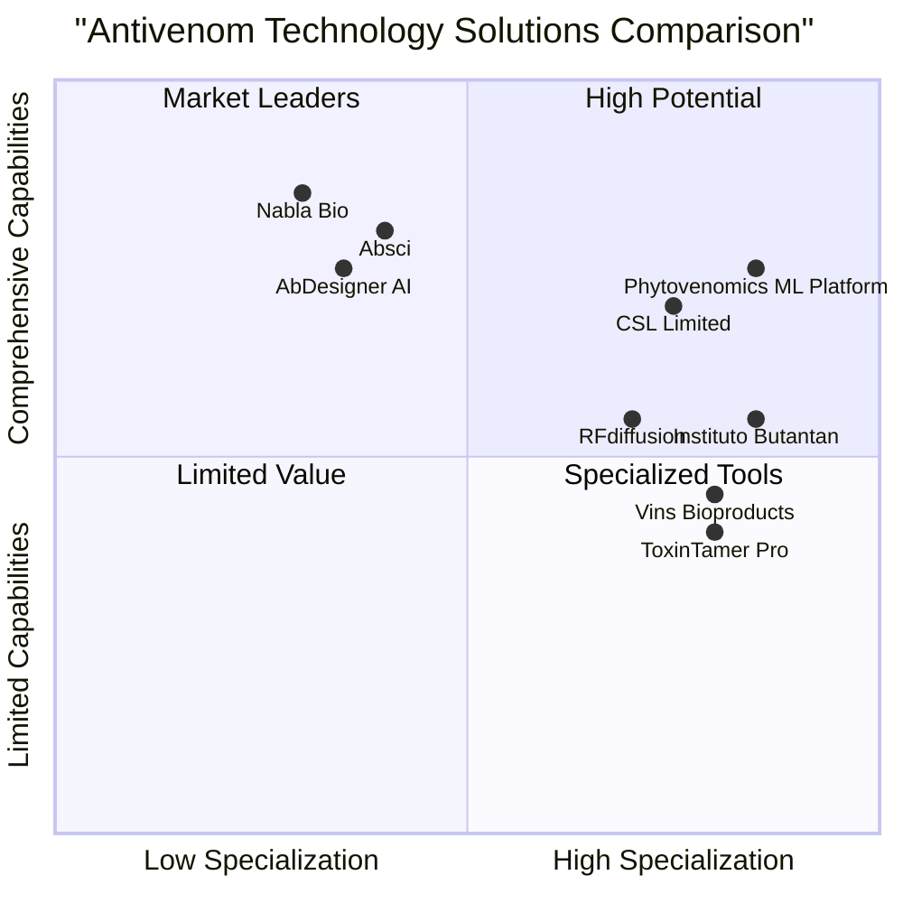

# Phytovenomics ML Platform: Market Research Report

**Date**: May 29, 2025

## Executive Summary

The Phytovenomics ML Platform represents a significant innovation in the antivenom production landscape by combining cutting-edge machine learning techniques with plant-based antibody production systems. This report analyzes the market opportunity, competitive landscape, and strategic positioning for this revolutionary approach to antivenom development.

Our analysis indicates that the Phytovenomics ML Platform addresses critical global healthcare needs in snake envenomation treatment, with particular value for underserved regions. The global antivenom market is projected to reach $2.74 billion by 2029 (CAGR 7.4%), while the broader AI protein design market is experiencing even faster growth at 14-16% CAGR. By integrating these two high-growth sectors, Phytovenomics is positioned to capture significant market share and potentially revolutionize how antivenoms are developed and manufactured worldwide.

Key competitive advantages include superior cost-efficiency, improved safety profiles, enhanced accessibility for neglected regions, thermal stability advantages for tropical climates, and the ability to rapidly develop custom solutions for region-specific venomous species.

## 1. Industry Overview

### 1.1 Global Antivenom Market

The global antivenom market shows consistent growth with strong future projections:

| Year | Market Size | CAGR |
|------|-------------:|------:|
| 2025 | $2.06 billion | 7.4% |
| 2029 | $2.74 billion | 7.4% |
| 2034 | $2.8 billion | 8.1% |

This market growth is driven by several factors:

1. **Rising incidence of snakebites**: The WHO estimates approximately 5.4 million snakebites annually, resulting in 1.8-2.7 million envenomings and 81,000-138,000 deaths.

2. **Increasing awareness**: Growing recognition of snakebite envenoming as a neglected tropical disease has led to increased funding and research.

3. **Limited innovation**: The antivenom field has seen minimal technological disruption, with production methods largely unchanged for decades.

4. **Supply challenges**: Current production methods struggle to meet global demand, particularly in developing regions with the highest snakebite incidence.

### 1.2 AI-Driven Protein Design Market

The AI protein design market represents a rapidly evolving technological sector:

| Segment | 2025 Value | 2030-2035 Projection | CAGR |
|---------|-------------:|---------------------:|------:|
| In silico protein design | $0.58-0.74 billion | $1.13-3.15 billion | 14.1-16.27% |
| Broader protein engineering | $3.6-5.09 billion | $8.2-17.83 billion | 9.5-16.97% |
| Monoclonal antibodies | $331.01 billion | $580.61 billion (by 2029) | 15.1% |

This market is characterized by:

1. **Technological acceleration**: Deep learning approaches have dramatically improved protein structure prediction and design capabilities.

2. **Reduced development timelines**: AI-driven approaches can cut traditional development cycles from years to months.

3. **Investment surge**: Significant venture capital flowing into computational protein design startups.

4. **Cross-application potential**: Technologies developed for one therapeutic area can often be applied to others.

### 1.3 Plant-Based Biologic Production

Plant-based expression systems for biologics are gaining traction as alternatives to traditional mammalian cell culture and microbial systems:

- **Market positioning**: Currently a niche but growing segment within the broader biologics manufacturing market.

- **Key advantages**: Lower production costs, reduced risk of mammalian pathogens, potential for simplified storage and distribution.

- **Challenges**: Regulatory pathways less established, potential for different glycosylation patterns affecting drug properties.

- **Recent developments**: Several plant-made pharmaceuticals have received regulatory approvals, including Elelyso (Protalix/Pfizer) and Vervalen (Medicago/GSK).

## 2. Market Analysis

### 2.1 Market Segmentation

#### 2.1.1 Geographic Regions

| Region | Antivenom Demand | Market Characteristics |
|--------|------------------:|-----------------------|
| Asia-Pacific | Very High | Highest snakebite burden; limited access to antivenoms; cost sensitivity; tropical climate challenges |
| Africa | Very High | Severe snakebite burden; significant affordability issues; inadequate healthcare infrastructure; distribution challenges |
| Latin America | High | Strong regional production capacity; established research centers; varying access across countries |
| North America | Moderate | Higher profit margins; strong regulatory framework; emphasis on quality and safety; market for travel medicine |
| Europe | Moderate | Focus on innovation; capacity for premium products; export-oriented manufacturing; strong regulatory oversight |
| Middle East | Low-Moderate | Growing healthcare infrastructure; increasing healthcare spending; reliance on imports |

#### 2.1.2 Antivenom Types

| Type | Current Market Share | Growth Potential | Key Characteristics |
|------|---------------------:|------------------:|--------------------|
| Polyvalent | 65% | Moderate | Effective against multiple species; broader coverage; higher production costs |
| Monovalent | 35% | Low | Species-specific; higher efficacy for targeted species; regional importance |
| Conventional/Animal-derived | 92% | Declining | Traditional horse/sheep antibody production; established manufacturing; adverse reaction risks |
| Recombinant/Novel approaches | 8% | High | Emerging technologies; improved safety profiles; higher development costs; potential for standardization |

#### 2.1.3 End-User Segments

| Segment | Market Share | Growth Rate | Requirements |
|---------|-------------:|------------:|-------------|
| Hospitals | 52% | Moderate | Reliable supply; proven efficacy; ease of administration; storage stability |
| Ambulatory Surgical Centers | 18% | High | Rapid response options; clear protocols; portable formats |
| Academic & Research | 14% | High | Novel approaches; customizability; data integration |
| Clinics | 11% | Moderate | Cost-effectiveness; simplified administration; longer shelf-life |
| Other (Military, NGOs, etc.) | 5% | Variable | Field deployment capabilities; ambient temperature stability; ease of use |

### 2.2 Market Drivers and Restraints

#### 2.2.1 Market Drivers

1. **Persistent unmet need**: Antivenom shortages remain a critical global health issue, particularly in the regions with highest snakebite incidence.

2. **Limitations of current therapies**: Traditional antivenoms have significant drawbacks including adverse reactions, variable efficacy, and cold chain requirements.

3. **Technology convergence**: Machine learning capabilities in protein design have reached maturity just as plant-based expression systems are becoming established.

4. **Supportive initiatives**: WHO's strategy for prevention and control of snakebite envenoming has increased funding and awareness.

5. **Cost pressures**: Healthcare systems globally are seeking more cost-effective solutions for treating neglected tropical diseases.

#### 2.2.2 Market Restraints

1. **Regulatory complexity**: Novel production methods face uncertain regulatory pathways, potentially extending development timelines.

2. **Scientific barriers**: Designing antibodies that neutralize diverse toxins remains technically challenging.

3. **Infrastructure limitations**: Limited healthcare infrastructure in high-need regions affects distribution and administration.

4. **Market fragmentation**: Different snake species across regions creates a fragmented market requiring tailored solutions.

5. **Conservative clinical adoption**: Medical practitioners may be slow to adopt novel approaches without extensive clinical validation.

### 2.3 Porter's Five Forces Analysis

#### 2.3.1 Threat of New Entrants (Moderate)
- High capital requirements and specialized expertise present significant barriers
- Novel technological approaches are reducing traditional barriers
- IP landscape relatively open compared to other therapeutic areas

#### 2.3.2 Bargaining Power of Suppliers (Moderate)
- Specialized equipment and reagent suppliers have moderate leverage
- Computing resources increasingly commoditized
- Access to quality snake venoms for research remains a bottleneck

#### 2.3.3 Bargaining Power of Buyers (Moderate-High)
- Government procurement agencies and NGOs have significant buying power
- Limited alternatives increase dependency on available products
- Cost sensitivity extremely high in developing markets

#### 2.3.4 Threat of Substitutes (Low-Moderate)
- Few effective alternatives to immunotherapy for snakebite treatment
- Emerging small molecule approaches still in early development
- Preventive strategies complement rather than replace treatments

#### 2.3.5 Competitive Rivalry (Moderate)
- Limited number of established manufacturers
- Geographical specialization reduces direct competition
- Increasing research interest may intensify future competition

## 3. Competitor Landscape

### 3.1 Traditional Antivenom Producers

| Company | Market Position | Key Products | Strengths | Weaknesses |
|---------|----------------|--------------|-----------|------------|
| Instituto Butantan (Brazil) | Market leader in Latin America | Polyvalent bothropic-crotalic antivenom | Established manufacturing capacity; strong regional coverage | Limited global reach; traditional production methods; animal welfare concerns |
| Vins Bioproducts Ltd (India) | Major player in Asia | VINS Polyvalent, VINS Premium serums | Wide geographic coverage; established distribution | Quality consistency issues; adverse reactions; limited innovation |
| CSL Limited (Australia) | Premium segment leader | Australian Polyvalent Antivenom | High-quality products; strong safety profile | Very high cost; focused on developed markets; limited tropical species coverage |
| Bioclon Institute (Mexico) | Strong regional player | Anallatro, Anavip | Innovative lyophilized formats; good stability profile | Limited expansion beyond Americas; traditional production methods |
| Sanofi Pasteur (France) | Specialty focus | FAV-Afrique (discontinued) | Strong quality control; global distribution network | Reduced commitment to antivenom market; high prices |
| Serum Institute of India | Volume manufacturer | Various antivenoms | High production capacity; cost-effective | Variable effectiveness reports; limited species coverage |
| Inosan Biopharma (Spain) | European specialist | Equine-derived antivenoms | GMP compliance; regulatory expertise | Traditional technology; limited innovation; higher costs |

### 3.2 Emerging Technology Companies

| Company | Technology Focus | Development Stage | Strengths | Weaknesses |
|---------|-----------------|-------------------|-----------|------------|
| Ophirex (USA) | Small molecule inhibitors | Clinical trials | Broad-spectrum approach; ambient stability | Early clinical validation; different mechanism of action than immunotherapy |
| Inoventics (Denmark) | Recombinant antibodies in CHO cells | Pre-clinical | High consistency; reduced adverse reactions | High manufacturing costs; requires cold chain; early development stage |
| VenomAb (UK) | Camelid nanobodies | Discovery phase | High thermal stability; potentially oral formulations | Limited species coverage; early stage technology; scalability unknown |
| Abvance Therapeutics | AI-designed synthetic antibodies | Research phase | Novel engineering approach; computationally optimized | No clinical data; traditional manufacturing platform; high development costs |
| ToxinVac (Australia) | DNA vaccines against toxins | Preclinical | Preventative approach; potential for mass prophylaxis | Completely different use case; effectiveness uncertainty; not a treatment |

### 3.3 AI/ML Protein Design Competitors

| Platform | Company | Key Capabilities | Strengths | Weaknesses for Antivenom Applications |
|----------|---------|------------------|-----------|--------------------------------------|
| AbDesigner AI | AbCellera | Antibody discovery and optimization | Proven platform with approved drugs; integrated with high-throughput screening | Not specialized for toxin neutralization; expensive subscription; not optimized for plant expression |
| Nabla JAM | Nabla Bio | De novo antibody design for difficult targets | Advanced structural modeling; validated for GPCRs | Not focused on plant expression; primarily targeting oncology; high computational requirements |
| RFdiffusion | RoseTTAFold (academic/open source) | Protein structure generation | Open source; proven for toxin neutralization | Requires significant expertise; not integrated workflow; limited optimization for manufacturability |
| ToxinTamer Pro | Venomtech | Toxin neutralization platform | Specialized for venom toxins; extensive toxin database | Limited structure-based design; no plant expression optimization; closed ecosystem |
| Absci | Absci | End-to-end antibody design platform | Strong ML capabilities; proven results | Focus on mammalian expression systems; proprietary technology; high cost |

### 3.4 Competitive Positioning Map

## 4. Target Audience Analysis

### 4.1 User Segments

#### 4.1.1 Primary Target Users

**Biotechnology Researchers**
- **Key needs**: Fast antibody design solutions; accurate binding prediction; plant optimization
- **Usage patterns**: Iterative design cycles; experimental validation integration; high customization
- **Value drivers**: Time savings; increased success rates; reduced experimental iterations
- **Challenges**: Integration with existing workflows; learning curve; validation requirements

**Product Development Scientists**
- **Key needs**: Antibody cocktail design; broad toxin neutralization coverage; manufacturability optimization
- **Usage patterns**: Regional customization; scale-up planning; regulatory pathway modeling
- **Value drivers**: Development cost reduction; increased product efficacy; manufacturing feasibility
- **Challenges**: Translation to GMP production; regulatory documentation; risk minimization

**Laboratory Technicians**
- **Key needs**: Binding affinity prediction; experiment prioritization; protocol automation
- **Usage patterns**: Daily usage for screening candidates; integration with lab equipment; batch processing
- **Value drivers**: Reduced failed experiments; clearer success criteria; standardized workflows
- **Challenges**: Technical expertise requirements; integration with LIMS; reliable prediction accuracy

**Production Managers**
- **Key needs**: Plant expression optimization; yield prediction; process parameter guidance
- **Usage patterns**: Process development support; yield optimization; troubleshooting
- **Value drivers**: Increased production efficiency; reduced costs; improved consistency
- **Challenges**: Implementation in GMP environment; validation requirements; scale-up factors

**Research Directors**
- **Key needs**: Visualization tools; strategic planning support; portfolio management
- **Usage patterns**: Periodic review; decision support; investment planning
- **Value drivers**: Strategic insights; resource optimization; development pipeline clarity
- **Challenges**: ROI demonstration; competitive positioning; resource allocation

#### 4.1.2 Secondary Target Users

**Regulatory Affairs Specialists**
- **Key needs**: Documentation support; design process transparency; validation data
- **Value drivers**: Streamlined submissions; reduced regulatory questions; clearer development history

**Global Health Organizations**
- **Key needs**: Accessibility solutions; regional customization; cost-effective production
- **Value drivers**: Expanded treatment access; reduced mortality; healthcare system impact

**Academic Researchers**
- **Key needs**: Novel antibody design approaches; flexible research tools; publication support
- **Value drivers**: Innovation potential; research acceleration; collaborative opportunities

### 4.2 Regional User Requirements

| Region | Primary Need | Special Requirements | Market Potential |
|--------|-------------|----------------------|------------------|
| Asia-Pacific | Broad-spectrum antivenoms for diverse species | Heat stability; low cost; minimal cold chain | Very High |
| Sub-Saharan Africa | Polyvalent solutions for regional species | Field deployment capability; minimal training needs | Very High |
| Latin America | Region-specific customized formulations | Local production potential; regulatory alignment | High |
| North America | High-quality, specialized solutions | Detailed documentation; extensive safety data | Moderate |
| Europe | Innovation platform with research applications | Regulatory compliance; ethical production | Moderate |

### 4.3 User Persona Analysis

**Dr. Maria Chen** - Lead Antibody Engineer, Biotechnology Company
- **Background**: PhD in Protein Engineering with 8 years industry experience
- **Goals**: Accelerate antibody discovery timeline by 50%; reduce experimental iterations
- **Pain Points**: Current computational tools lack accuracy; plant expression optimization is trial-and-error
- **Usage Scenario**: Designs antibodies against newly identified toxins from regional snake species

**Dr. Kwame Nkrumah** - Research Director, African Antivenom Initiative
- **Background**: Clinical immunologist with public health experience
- **Goals**: Develop affordable antivenoms suitable for rural clinical settings
- **Pain Points**: Existing antivenoms require cold chain; adverse reaction rates too high; coverage incomplete
- **Usage Scenario**: Needs to design antibody cocktails effective against 20+ regional snake species

**Jennifer Lopez** - Production Manager, Plant-Based Biologics Manufacturer
- **Background**: MSc in Bioprocess Engineering with plant expression expertise
- **Goals**: Maximize antibody expression yield in plant systems; ensure consistent glycosylation
- **Pain Points**: Unpredictable expression levels; sequence optimization is laborious
- **Usage Scenario**: Optimizes antibody sequences for tobacco expression system for scale-up

## 5. Pricing Analysis

### 5.1 Current Market Pricing

| Product/Service Type | Price Range | Market Positioning | Key Factors |
|---------------------|-------------:|--------------------|-------------|
| Traditional antivenoms | $18-$1,800 per vial | Essential healthcare product | Manufacturing costs; geographical market; species coverage; provider markup |
| ML platform subscriptions | $15,000-$200,000 per year | Enterprise software | Capabilities; user count; support level; customization |
| Custom antibody design services | $25,000-$150,000 per project | Specialized research service | Complexity; timeline; exclusivity; validation requirements |
| Plant expression optimization | $5,000-$30,000 per construct | Technical service | System complexity; optimization goals; timeline |
| Consulting services | $10,000-$50,000 per month | Knowledge service | Expertise level; deliverables; exclusivity |

### 5.2 Competitive Pricing Analysis

| Competitor | Product/Service | Price Point | Value Proposition |
|------------|----------------|-------------:|-------------------|
| AbDesigner AI | Enterprise Platform | $180,000/year | Comprehensive antibody design with experimental integration |
| RFdiffusion | Open Source + Support | $0 + consulting | Advanced structural modeling with customization flexibility |
| Instituto Butantan | Traditional Antivenom | $30-$50/vial | Established efficacy; regulatory approved; immediate availability |
| Inoventics | Custom Design Service | $120,000/project | Recombinant antibody design with preliminary testing |

### 5.3 Pricing Strategy Recommendations

#### 5.3.1 Platform Pricing Options

| Model | Structure | Target Segment | Advantages | Considerations |
|-------|-----------|----------------|------------|----------------|
| Enterprise License | $150,000-$200,000/year | Large pharmaceutical and biotechnology companies | Predictable revenue; customer commitment | High barrier to entry; requires executive buy-in |
| Per-Project | $30,000-$60,000/project | Medium companies; research institutions | Lower initial commitment; results-based pricing | Variable revenue; project management overhead |
| Freemium + Premium Features | Basic: Free Premium: $5,000-$10,000/month | Academic; startups; non-profits | Market penetration; user growth; data collection | Monetization challenges; support costs |
| Success-Based Licensing | Base fee + milestones/royalties | Commercial development partners | Aligned incentives; shared upside | Complex contracts; delayed revenue recognition |

#### 5.3.2 Value-Based Pricing Factors

- **Development time reduction**: 40-60% reduction in antibody design cycles
- **Experimental success rate**: 2-3x increase in first-pass design success
- **Manufacturing cost savings**: 30-50% reduction in production costs
- **Market access value**: Enabling entry to previously unprofitable market segments
- **Platform effect**: Increasing value with continued usage and data accumulation

## 6. Key Findings

### 6.1 Market Opportunity Assessment

| Opportunity | Size | Timeframe | Attractiveness |
|-------------|------|-----------|---------------|
| Plant-expressed antivenom development | $500M-$1B potential market | 3-7 years | Very High |
| ML platform licensing to biotech companies | $50M-$100M annual market | 1-3 years | High |
| Custom antibody design services | $20M-$50M annual market | 1-2 years | Moderate-High |
| Academic and research partnerships | Limited direct revenue; high strategic value | Immediate | Moderate |
| Technology licensing to established manufacturers | $10M-$30M per deal | 2-4 years | High |

### 6.2 Competitive Advantage Analysis

#### 6.2.1 Sustainable Competitive Advantages

1. **Integrated technology approach**: Unique combination of ML antibody design optimized for plant expression systems

2. **Specialized toxin dataset**: Proprietary data on toxin-antibody interactions with higher relevance than general antibody datasets

3. **Domain expertise alignment**: Rare combination of computational biology, toxinology, and plant biotechnology expertise

4. **Cost structure advantage**: Significantly lower production costs enable market access where others cannot compete

5. **First-mover advantage**: Establishing presence in underserved markets creates barriers to entry

#### 6.2.2 Comparative SWOT Analysis

**Strengths**
- Purpose-built ML architecture for toxin neutralization
- Plant expression optimization capabilities
- Lower production costs than mammalian cell systems
- Enhanced thermal stability for tropical deployment
- Specific focus on neglected tropical disease

**Weaknesses**
- Limited clinical validation data
- Uncertain regulatory pathway
- Smaller company scale vs established players
- Novel technology adoption barriers
- Less established distribution channels

**Opportunities**
- Large unmet medical need in developing regions
- WHO and foundation funding for neglected diseases
- Growing recombinant antibody market
- Technological differentiation from traditional approaches
- Expansion beyond snake venoms to other toxins

**Threats**
- Competing next-generation approaches
- Regulatory hurdles for novel production methods
- Intellectual property landscape evolution
- Conservative procurement policies
- Limited healthcare infrastructure in key markets

### 6.3 Growth Strategy Recommendations

#### 6.3.1 Short-Term Priorities (1-2 years)

1. **Technology validation**: Demonstrate efficacy of ML-designed plant-expressed antibodies against priority toxins

2. **Strategic partnerships**: Establish relationships with plant-based manufacturing facilities for scale-up

3. **Platform development**: Complete core functionality of the ML platform with validated accuracy metrics

4. **Initial commercialization**: Launch antibody design services for research applications

5. **Regulatory pathway**: Engage with regulatory authorities to define approval pathway

#### 6.3.2 Medium-Term Objectives (3-5 years)

1. **Product development**: Advance lead antivenom candidates through preclinical and early clinical testing

2. **Geographic expansion**: Establish regional partnerships in high-need areas (South Asia, Africa, Latin America)

3. **Platform enhancement**: Develop advanced features for cocktail optimization and plant-specific expression

4. **Manufacturing scale-up**: Establish GMP-compliant production capacity through partnerships

5. **Additional applications**: Explore ML platform applications for other therapeutic areas

#### 6.3.3 Long-Term Vision (5+ years)

1. **Product commercialization**: Obtain regulatory approval for plant-derived antivenom products

2. **Global impact**: Establish distribution networks in high-need regions

3. **Technology leadership**: Position as the leading platform for plant-expressed antibody design

4. **Portfolio expansion**: Develop products for additional venoms and toxins

5. **Transformative impact**: Significantly reduce global mortality from snake envenomation

## 7. Strategic Recommendations

### 7.1 Product Development Strategy

1. **Prioritize validation**: Focus initial efforts on demonstrating ML prediction accuracy against experimental results

2. **Regional customization**: Develop specific antibody cocktails for geographic regions with highest need

3. **Platform-first approach**: Establish the ML platform as a revenue stream while products advance through development

4. **Tiered product strategy**: Create:
   - Research-grade antibodies for academic and R&D markets (near-term)
   - GMP-manufactured antibodies for clinical trials (medium-term) 
   - Fully approved therapeutic products (long-term)

5. **Modular design**: Structure the platform to allow component licensing and integration with existing solutions

### 7.2 Market Entry Strategy

1. **Initial target segments**: 
   - Academic and research organizations (lower regulatory barriers)
   - Biotechnology companies developing biotherapeutics
   - Non-profit organizations focused on neglected tropical diseases

2. **Geographic prioritization**:
   - Initial focus: Research markets in North America and Europe
   - Secondary expansion: Research and development centers in India, Brazil, and South Africa
   - Tertiary focus: Clinical applications in high-need regions

3. **Partnership approach**:
   - Technology: Cloud computing and ML infrastructure providers
   - Manufacturing: Established plant-based expression facilities
   - Distribution: Regional healthcare organizations and NGOs
   - Research: Academic centers in tropical medicine and toxinology

4. **Pilot programs**:
   - Establish demonstration projects in 2-3 high-need regions
   - Partner with local healthcare providers for real-world testing
   - Generate region-specific efficacy and economic data

### 7.3 Pricing and Business Model Recommendations

1. **Multi-tier pricing strategy**:
   - Premium pricing for commercial applications
   - Cost-plus pricing for non-profit and academic applications
   - Access programs for high-need regions

2. **Hybrid business model**:
   - Software-as-a-Service (SaaS) for the ML platform
   - Design services for custom antibody development
   - Licensing and royalties for manufactured products
   - Grant funding for humanitarian applications

3. **Value capture approaches**:
   - Upfront fees for design projects
   - Subscription access to the platform
   - Milestone payments for successful designs
   - Royalties on commercial products

### 7.4 Marketing and Communication Strategy

1. **Positioning statement**: "Phytovenomics ML Platform: Combining artificial intelligence with plant biotechnology to revolutionize antivenom accessibility worldwide."

2. **Key messaging framework**:
   - For researchers: "Accelerate antibody discovery with ML-optimized designs"
   - For manufacturers: "Plant-optimized antibodies for higher yields and lower costs"
   - For health organizations: "Cost-effective antivenoms for neglected populations"
   - For investors: "Disrupting a growing market with proprietary technology"

3. **Educational content strategy**:
   - Technical whitepapers on ML architecture and validation results
   - Case studies demonstrating successful antibody designs
   - Webinars on plant expression optimization techniques
   - Conference presentations at protein engineering and neglected disease forums

4. **Thought leadership initiatives**:
   - Publication in peer-reviewed journals
   - Industry partnerships for standards development
   - Public advocacy for innovative approaches to neglected diseases

## 8. Conclusion

The Phytovenomics ML Platform addresses a significant global health need through an innovative combination of cutting-edge technologies. By leveraging advances in machine learning for protein design and plant-based expression systems, the platform offers a compelling solution to the persistent challenges of antivenom production: high costs, limited accessibility, adverse reactions, and cold chain requirements.

The market opportunity is substantial, with growing demand for novel antivenom approaches and strong tailwinds from both technological advancement and increased global health focus on neglected tropical diseases. While challenges exist in regulatory pathways and technology adoption, the unique positioning of the Phytovenomics platform provides multiple sustainable competitive advantages.

By executing a strategic approach that combines platform licensing, service provision, and product development, Phytovenomics can establish itself as a transformative force in antivenom development while building a sustainable business model. The potential impact extends beyond commercial success to addressing a critical global health need responsible for significant mortality and disability worldwide.

---

*Report prepared by Emma, Product Manager*  
*May 29, 2025*
