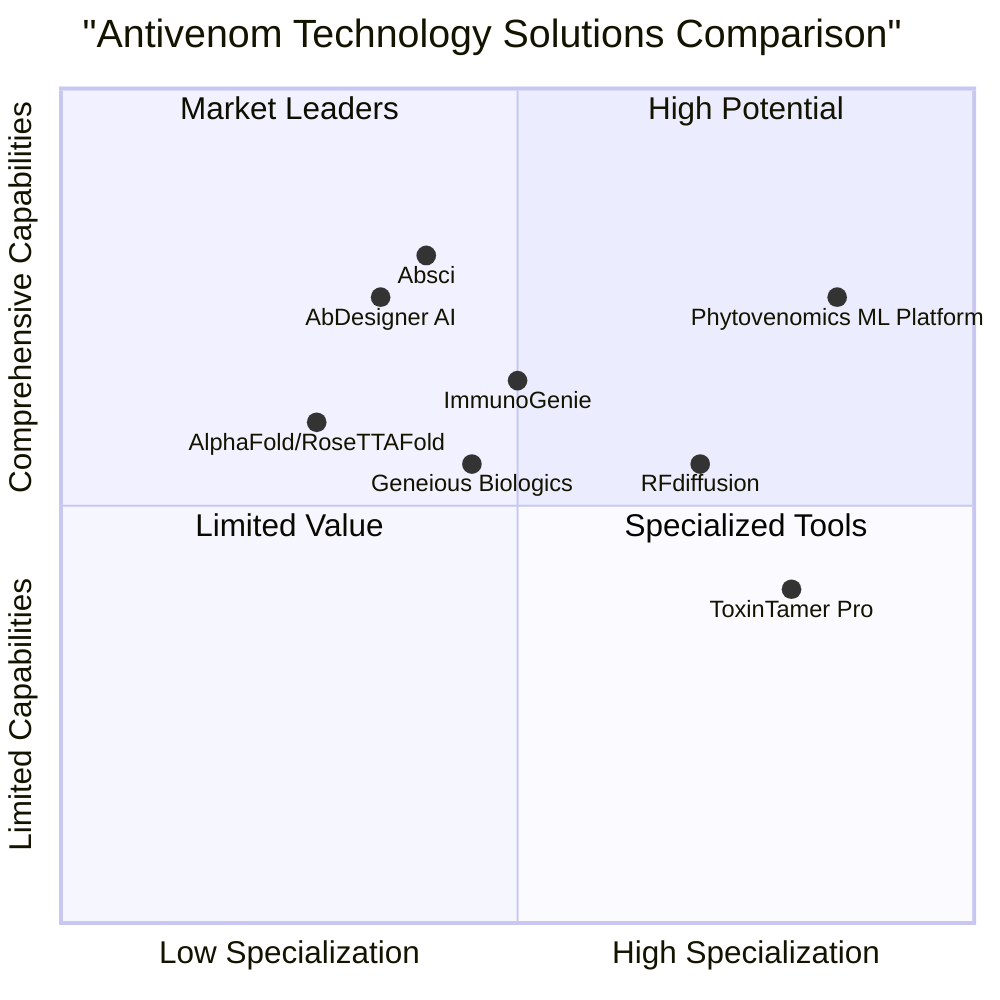

# Product Requirements Document: Phytovenomics ML Platform

**Project Name**: phytovenomics_ml_platform

**Date**: May 29, 2025

**Original Requirements**:
Develop a machine learning program for Phytovenomics, a Biotech startup focused on developing antivenom in plants. The program needs to develop antivenom cocktails to snake toxins by creating broadly neutralizing antibodies as well as specific antibodies.

## 1. Product Definition

### 1.1 Product Goals

1. Design and predict effective antibody sequences that can neutralize snake venom toxins when expressed in plant systems
2. Optimize antibody cocktail formulations to provide broad coverage against multiple snake species and toxin families
3. Generate plant-expression-optimized antibody variants with enhanced stability and production efficiency

### 1.2 User Stories

1. As a biotechnology researcher, I want to input snake venom toxin sequences and receive optimized antibody designs so that I can begin plant expression experiments
2. As a product development scientist, I want to design antibody cocktails that neutralize toxins from multiple snake species so that I can develop broadly effective antivenoms
3. As a laboratory technician, I want to predict the binding affinity of candidate antibodies against specific toxins so that I can prioritize candidates for experimental validation
4. As a production manager, I want to optimize antibody sequences for plant expression so that I can maximize yield and reduce production costs
5. As a research director, I want to visualize antibody-toxin binding interactions so that I can understand neutralization mechanisms

### 1.3 Competitive Analysis

| Competitor | Type | Pros | Cons |
|------------|------|------|------|
| AbDesigner AI | Commercial antibody design platform | Advanced ML algorithms for antibody design; intuitive UI; extensive validation data | Not specialized for toxin neutralization; expensive subscription; not optimized for plant expression |
| AlphaFold/RoseTTAFold | Open-source protein structure prediction | Highly accurate structure prediction; free for research use; large user community | Not specialized for antibody design; requires significant computational resources; limited antibody-antigen docking capabilities |
| Geneious Biologics | Antibody analysis platform | Comprehensive sequence analysis; integration with experimental data; collaborative features | Limited ML capabilities; not focused on plant expression; subscription-based |
| ImmunoGenie | Immunotherapy design software | Strong epitope prediction; databases of known antibodies; therapeutic focus | Not plant-optimized; primarily focused on human diseases rather than toxins; expensive license |
| RFdiffusion | Protein design tool | De novo protein design capabilities; proven for toxin neutralization; open source | Requires significant expertise; not integrated workflow; limited optimization for manufacturability |
| ToxinTamer Pro | Toxin neutralization platform | Specialized for venom toxins; extensive toxin database; sequence-based models | Limited structure-based design; no plant expression optimization; closed ecosystem |
| Absci | AI-powered drug discovery platform | End-to-end antibody design; strong ML capabilities; proven results | Focus on mammalian expression systems; proprietary technology; high cost |

### 1.4 Competitive Quadrant Chart

## 2. Technical Specifications

### 2.1 Requirements Analysis

The Phytovenomics ML Platform must integrate multiple machine learning approaches to address the complex challenge of designing plant-expressed antibodies against snake venom toxins. The platform must analyze toxin sequences and structures, design antibodies with high binding affinity and neutralization capability, optimize these antibodies for plant expression, and formulate effective antibody cocktails.

The system must incorporate the following technical capabilities:

1. **Toxin Analysis and Classification**:
   - Process and annotate snake venom toxin sequences
   - Classify toxins by family, function, and species
   - Predict toxin structures (when not experimentally determined)
   - Identify conserved epitopes across toxin families

2. **Antibody Design**:
   - Generate antibody sequences with high predicted binding affinity to target toxins
   - Optimize complementarity-determining regions (CDRs) for specific toxin binding
   - Design broadly neutralizing antibodies targeting conserved epitopes
   - Maintain antibody stability and manufacturability

3. **Plant Expression Optimization**:
   - Optimize codon usage for plant expression systems
   - Predict and minimize potential glycosylation issues
   - Enhance protein folding and secretion in plant cells
   - Maximize expression yield and stability

4. **Antibody-Toxin Interaction Prediction**:
   - Model antibody-toxin binding interactions
   - Calculate binding affinity and dissociation constants
   - Predict neutralization efficacy
   - Visualize binding interfaces

5. **Cocktail Formulation**:
   - Analyze toxin coverage for different antibody combinations
   - Predict synergistic effects between antibodies
   - Optimize cocktail compositions for broad neutralization
   - Balance efficacy with manufacturing complexity

6. **Data Management and Integration**:
   - Store and manage toxin and antibody sequences
   - Track design iterations and experimental validation results
   - Integrate with laboratory information management systems
   - Support collaborative research workflows

### 2.2 Requirements Pool

#### P0 (Must Have)

1. ML model for antibody sequence generation based on toxin input
2. Binding affinity prediction between antibodies and toxins
3. Plant expression optimization for antibody sequences
4. Epitope identification and analysis on toxin sequences
5. Toxin family classification system
6. Basic antibody cocktail composition suggestions
7. Secure data storage for sequences and design history
8. User authentication and role-based access control
9. API for integration with laboratory systems
10. Export functionality for sequences and design parameters

#### P1 (Should Have)

1. 3D visualization of antibody-toxin binding interactions
2. Advanced cocktail optimization algorithms
3. Dashboard for tracking design projects and experiments
4. Batch processing for multiple toxins or species
5. Performance metrics for antibody designs
6. Comparative analysis between design iterations
7. Codon optimization for multiple plant species
8. Prediction of antibody expression yield in plants
9. Integration with public toxin and antibody databases
10. Collaborative features for team-based design

#### P2 (Nice to Have)

1. Machine learning models that improve with experimental feedback
2. Automated design workflow suggestions
3. Cost estimation for antibody production
4. Virtual screening of designs against toxin libraries
5. Integration with liquid handling robots for experimental setup
6. Mobile application for monitoring designs and experiments
7. Natural language processing for scientific literature mining
8. Regulatory compliance documentation assistance
9. Cross-species toxin neutralization prediction
10. Manufacturing process simulation

### 2.3 ML Architecture and Data Requirements

#### 2.3.1 ML Core Components

1. **Toxin Analysis Module**:
   - Sequence-based toxin classification using convolutional neural networks
   - Structure prediction adapting AlphaFold2 or RoseTTAFold for toxins
   - Epitope prediction using transformer-based models

2. **Antibody Design Module**:
   - Protein language models (similar to ESM-2, ProtBERT) adapted for antibody design
   - Generative adversarial networks for CDR sequence generation
   - Reinforcement learning for iterative optimization

3. **Plant Expression Module**:
   - Random forest models for codon usage optimization
   - Neural networks for glycosylation and proteolytic cleavage prediction
   - Regression models for yield prediction

4. **Binding Prediction Module**:
   - Deep learning models for binding affinity prediction
   - Physics-based scoring functions for interaction energetics
   - Graph neural networks for interface analysis

5. **Cocktail Optimization Module**:
   - Combinatorial optimization algorithms
   - Multi-objective evolutionary algorithms
   - Coverage analysis using statistical methods

#### 2.3.2 Data Requirements

1. **Training Data**:
   - Snake venom toxin sequences (minimum 10,000 entries)
   - Known antibody-toxin binding pairs (minimum 1,000 pairs)
   - Experimentally validated antibody neutralization data
   - Plant expression efficiency data for various antibody constructs
   - Structure data for toxins and antibodies (X-ray, cryo-EM, or reliable predictions)

2. **Validation Data**:
   - Independent set of antibody-toxin binding data not used in training
   - Plant expression results for designed antibodies
   - Neutralization assay results

3. **External Data Sources**:
   - UniProt for protein sequences
   - Protein Data Bank for structures
   - Immune Epitope Database
   - VenomZone and other toxin databases
   - Plant protein expression databases

### 2.4 UI Design Draft

#### 2.4.1 Main Dashboard

- Overview of active projects
- Recent designs and their predicted metrics
- Status of running computations
- Quick access to key functions

#### 2.4.2 Project Workspace

- Project details and objectives
- Target toxins list and properties
- Designed antibodies with key metrics
- Experimental validation results

#### 2.4.3 Toxin Analysis Interface

- Sequence input and preprocessing options
- Classification results and confidence scores
- Structure visualization
- Identified epitopes and conserved regions

#### 2.4.4 Antibody Design Interface

- Design constraints and parameters
- Generated antibody candidates
- Scoring metrics for each design
- Iteration history and improvements

#### 2.4.5 Plant Optimization Interface

- Plant expression system selection
- Codon optimization settings
- Yield and stability predictions
- Modification suggestions

#### 2.4.6 Cocktail Formulation Interface

- Antibody selection for combination
- Coverage visualization across toxin families
- Synergy predictions
- Final formulation recommendations

#### 2.4.7 Visualization Module

- 3D interactive models of toxins and antibodies
- Binding interface analysis
- Sequence alignments
- Performance metrics graphs

### 2.5 Technical Implementation Considerations

1. **System Architecture**:
   - Microservices-based approach for modularity and scalability
   - Containerized deployment for consistent environments
   - High-performance computing integration for intensive calculations

2. **Technology Stack**:
   - Backend: Python (TensorFlow/PyTorch for ML, Flask/FastAPI for API)
   - Frontend: React with visualization libraries (D3.js, Mol*)
   - Database: PostgreSQL for relational data, MongoDB for documents
   - Computing: GPU support for deep learning models

3. **Integration Points**:
   - Laboratory information management systems (LIMS)
   - Experimental robotics platforms
   - Sequence analysis tools
   - Molecular modeling software

4. **Scalability and Performance**:
   - Distributed computing for intensive tasks
   - Caching strategies for frequent calculations
   - Asynchronous processing for long-running jobs
   - Batch processing capabilities

### 2.6 Open Questions

1. Which plant expression systems will be prioritized (tobacco, rice, moss, etc.)?
2. What is the target runtime for antibody design iterations?
3. Will the system need to interface with specific laboratory equipment?
4. What level of explainability is required for the ML predictions?
5. Are there specific regulatory considerations for documenting the design process?
6. What volume of concurrent users needs to be supported?
7. Will the system be deployed on-premises or in a cloud environment?
8. What metrics will be used to validate the ML models' performance?

## 3. Success Metrics

### 3.1 Technical Success Metrics

1. **Prediction Accuracy**:
   - >80% accuracy in toxin classification
   - Binding affinity predictions within 1.0 kcal/mol of experimental values
   - Plant expression yield predictions within 25% of actual results

2. **Performance Metrics**:
   - Antibody design generation in <24 hours per toxin
   - Structural modeling in <2 hours per protein
   - System uptime >99.5%

3. **Coverage Metrics**:
   - Successful design of antibodies for >90% of input toxins
   - Cocktail formulations covering >95% of target species' toxins

### 3.2 Business Success Metrics

1. **Product Development Impact**:
   - 50% reduction in time from toxin identification to validated antibody
   - 30% improvement in first-pass success rate for designed antibodies
   - 40% reduction in experimental iterations required

2. **Cost Efficiency**:
   - 65% reduction in antibody development costs compared to traditional methods
   - 50% increase in plant expression yield for designed antibodies

3. **Platform Adoption**:
   - >90% of company's antibody design projects using the platform
   - Positive user satisfaction ratings (>8/10)

## 4. Timeline and Phases

### 4.1 Phase 1: Core Platform Development (Months 1-6)

- ML architecture design and implementation
- Basic UI development
- Toxin analysis and classification module
- Initial antibody design capabilities
- Data pipeline establishment

### 4.2 Phase 2: Advanced Features (Months 7-12)

- Plant optimization module
- Binding prediction refinement
- Cocktail formulation algorithms
- UI enhancements and visualizations
- Integration with laboratory systems

### 4.3 Phase 3: Optimization and Scaling (Months 13-18)

- Performance optimization
- Feedback incorporation systems
- Advanced analytics
- Expanded toxin coverage
- User training and documentation

## 5. Development Resources

### 5.1 Team Requirements

1. **Core Development Team**:
   - ML Engineer (specializing in protein design)
   - Computational Biologist
   - Full-stack Developer
   - UI/UX Designer
   - DevOps Engineer

2. **Subject Matter Experts**:
   - Immunologist
   - Plant Biotechnologist
   - Toxinologist
   - Antibody Production Specialist

### 5.2 Infrastructure Requirements

1. **Computing Resources**:
   - GPU cluster for model training
   - High-performance computing for molecular modeling
   - Cloud infrastructure for deployment

2. **Data Resources**:
   - Access to proprietary toxin databases
   - Subscription to protein structure repositories
   - Storage systems for sequence and experimental data

## 6. Risk Analysis

### 6.1 Technical Risks

1. **Data Limitation Risks**:
   - Insufficient training data for rare toxins
   - Mitigation: Data augmentation techniques, transfer learning

2. **Model Performance Risks**:
   - Inadequate prediction accuracy for complex toxins
   - Mitigation: Ensemble methods, continuous model refinement

3. **Integration Risks**:
   - Compatibility issues with laboratory systems
   - Mitigation: Standard API design, early integration testing

### 6.2 Business Risks

1. **Timeline Risks**:
   - Extended development time for complex ML models
   - Mitigation: Phased approach, priority on core functionalities

2. **Adoption Risks**:
   - Resistance from traditional antibody designers
   - Mitigation: User involvement in design, comprehensive training

3. **Regulatory Risks**:
   - Documentation requirements for ML-designed therapeutics
   - Mitigation: Built-in audit trails, explainable AI approaches

## 7. Conclusion

The Phytovenomics ML Platform represents a revolutionary approach to antivenom development, leveraging cutting-edge machine learning technologies to design plant-expressed antibodies against snake venom toxins. By integrating toxin analysis, antibody design, plant expression optimization, and cocktail formulation into a unified platform, Phytovenomics can significantly accelerate the development of next-generation antivenoms.

The platform's focus on plant expression systems addresses critical limitations of traditional antivenom production, including cost, accessibility, and adverse reactions. With the ML-driven approach, Phytovenomics is positioned to develop safer, more effective, and more affordable antivenom products with global impact potential.

This PRD outlines the requirements and specifications for developing this innovative platform, providing a clear roadmap for implementation while identifying key metrics for success and potential risks to address.